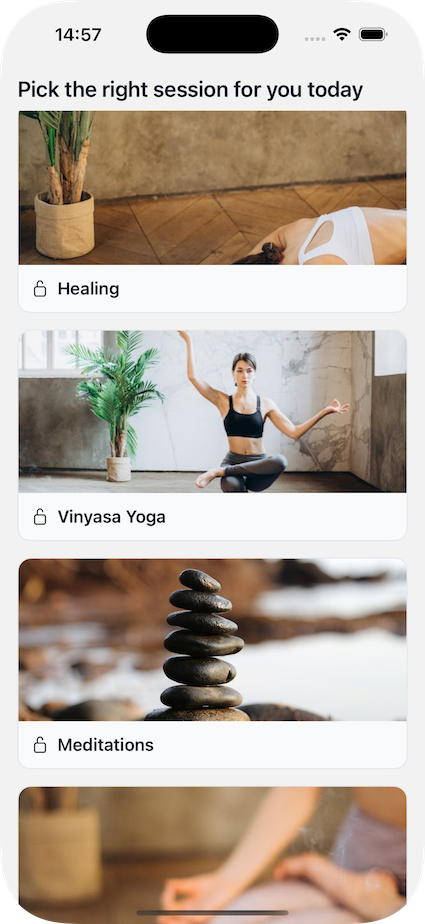
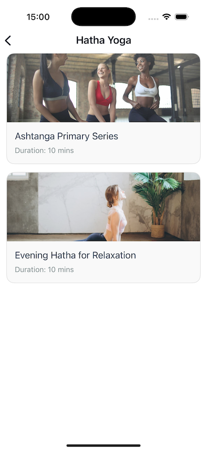
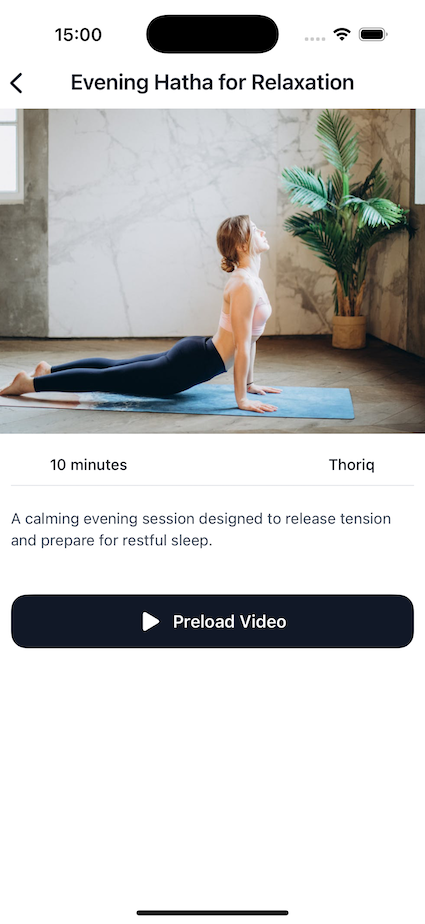
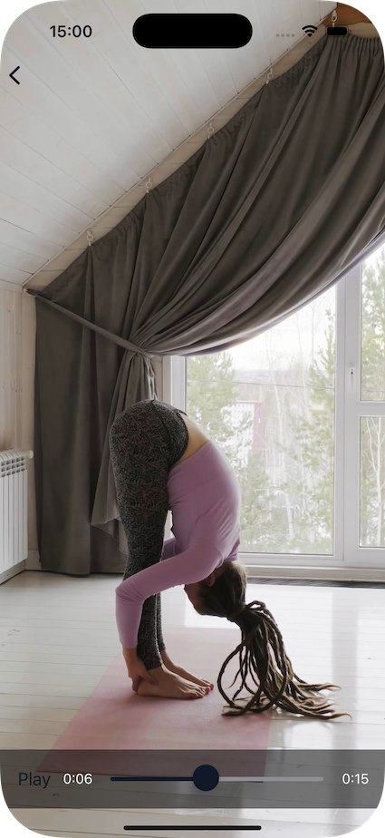

# Video Content Functionality Showcase (React Native)

An React Native app for browsing a library of yoga practice video sessions and watching them in-app, on request.

### What the app does

- **Browse session categories** (e.g. styles/types) loaded from a backend.
- **List sessions** within a selected category (duration, level, instructor, cover image).
- **View session details** with description and metadata.
- **Preload videos to device cache** with a progress indicator (so playback can start from a local file).
- **Play videos** using a custom player (play/pause + seek bar) built on `expo-av`.

### Tech overview

- **UI**: React Native + Expo
- **Navigation**: `@react-navigation/native` + native stack
- **Video**: `expo-av`
- **Caching / downloads**: `expo-file-system`
- **Backend calls**: `axios`
- **Auth (utility)**: Firebase Auth helper exists in `util/auth.js` (not currently wired into the main navigation flow)

### Data sources / configuration

- **`backendUrl`**: Base URL to a Firebase Realtime Database (used by `util/http.js`)
  - Reads:
    - `GET /sessionTypes.json`
    - `GET /sessions.json`
- **`videoBaseUrl`**: Base URL where MP4 files are hosted (the app builds URLs like `${videoBaseUrl}${videoId}.mp4`)

### Project entry points

- **Navigation / screens**: `App.js`
- **Practice flow screens**: `screens/Practice/*`
- **Video player**: `components/Video/VideoPlayer.js`

Here’s how the app looks:

PracticeHomeScreen:

SessionTypeScreen:

SessionDetailsScreen:

VideoPlayer:

